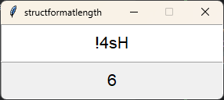

# structformatlength
structformatlength (sfl) is a small Python tool for quick and dirty calculation of byte lengths.

## Introduction
This project is helpful when working with the Python standard library [struct](https://docs.python.org/3/library/struct.html) which is used to convert bytes to Python values through formats. Formats consist of the byte order and a composition of characters representing a certain type.

The byte order is ignored in the conversion process in this program and can therefore be omitted. Below is just a quick reference:

| Character | Byte order             | Size     | Alignment |
|-----------|------------------------|----------|-----------|
| @         | native                 | native   | native    |
| =         | native                 | standard | none      |
| <         | little-endian          | standard | none      |
| \>        | big-endian             | standard | none      |
| !         | network (= big-endian) | standard | none      |

Here's a list of all formats supported by sfl:

| Format | C Type             | Python type       | Standard size |
|--------|--------------------|-------------------|---------------|
| x      | pad byte           |                   |               |
| c      | char               | bytes of length 1 | 1             |
| b      | signed char        | integer           | 1             |
| B      | unsigned char      | integer           | 1             |
| ?      | _Bool              | bool              | 1             |
| h      | short              | integer           | 2             |
| H      | unsigned short     | integer           | 2             |
| i      | int                | integer           | 4             |
| I      | unsigned int       | integer           | 4             |
| l      | long               | integer           | 4             |
| L      | unsigned long      | integer           | 4             |
| q      | long long          | integer           | 8             |
| Q      | unsigned long long | integer           | 8             |
| e      |                    | float             | 2             |
| f      | float              | float             | 4             |
| d      | double             | float             | 8             |
| F      | float complex      | complex           | 8             |
| D      | double complex     | complex           | 16            |
| s      | char[]             | bytes             | variable      |
| p      | char[]             | bytes             | variable      |

The format is assumed to already be implemented in the code, so for the calculator to work, the right format is assumed. If a faulty one is provided, [a faulty result may follow](https://en.wikipedia.org/wiki/Garbage_in,_garbage_out).

## Installation
In order to install/run this program, you need to have Git and Python installed.

First, clone the repository from GitHub. As sfl only requires the tkinter library for the GUI, which is a standard library, no extra dependencies are needed.
````powershell
git clone --branch master https://github.com/noahonfyre/structformatlength
````

Navigate to the newly cloned folder in your explorer or use your terminal:
````powershell
cd structformatlength
````

Run the program by double-clicking (when configured) or running the following command:
````powershell
python main.pyw
````

## Usage
Enter the format in the upper input. The calculated length is shown automatically in the lower entry and can be easily copied and pasted.
